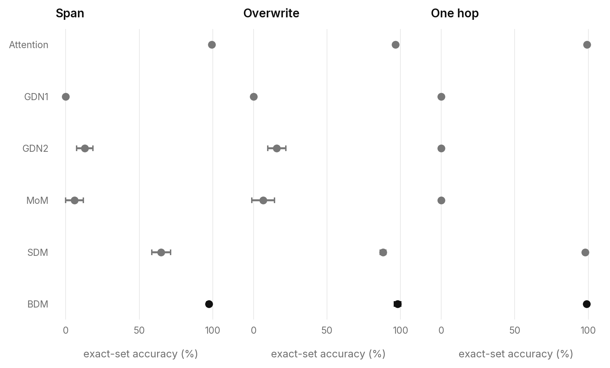
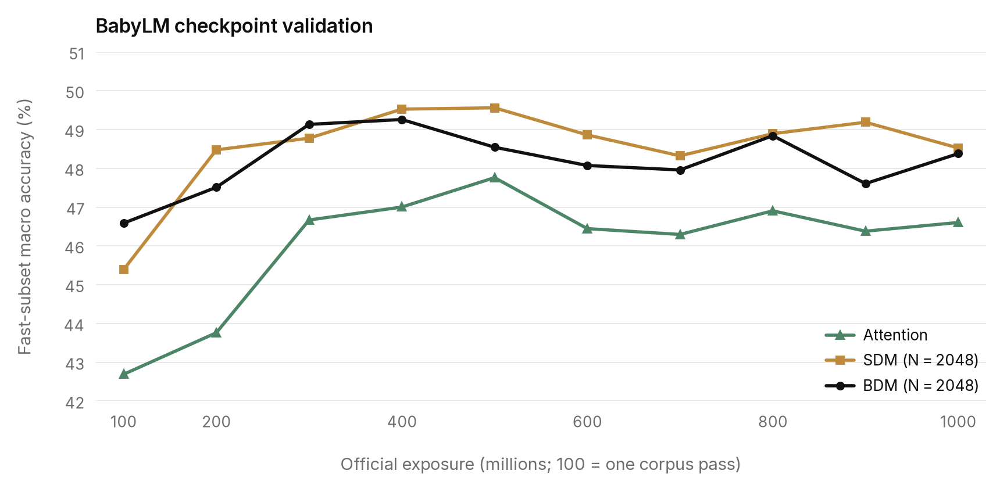
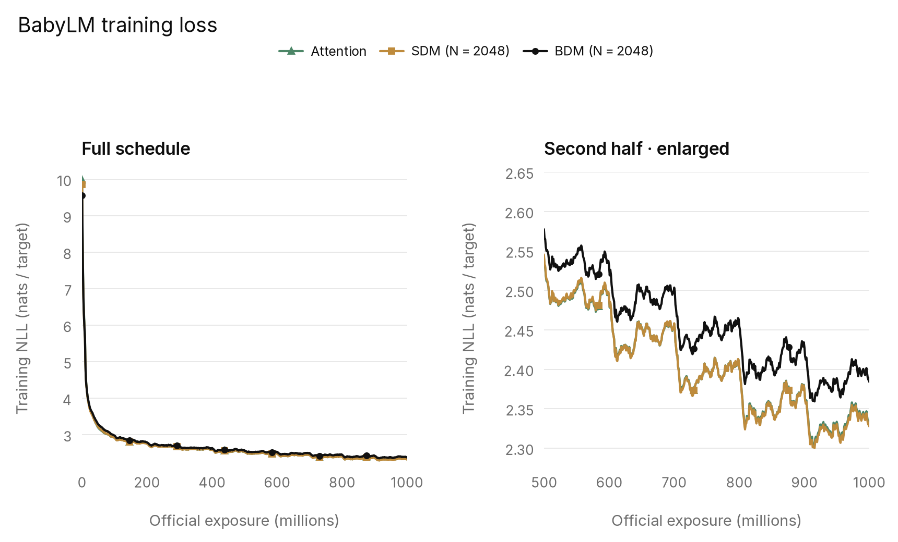
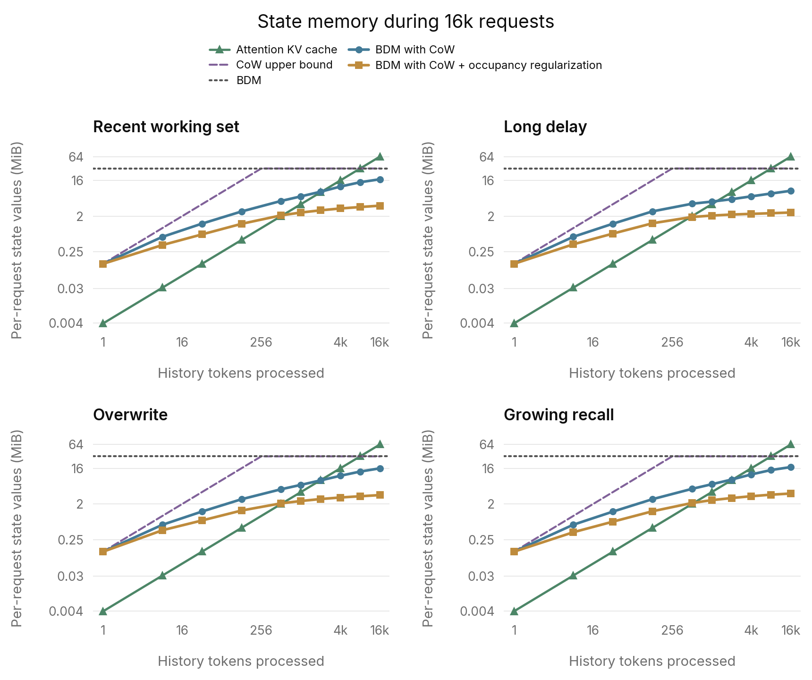

# Appendix

## Controller and parameterization

The main equations use one head. The GDN2 controller maps the normalized token
representation $h_t\in\mathbb R^D$ to bank coordinates of width $S$ and value
channels of width $V$. With $\phi=\mathrm{SiLU}$ and sigmoid $\sigma$,

$$
q_t=\mathcal N(\phi(W_qh_t)),\qquad
k_t=\mathcal N(\phi(W_kh_t)),\qquad
v_t=\phi(W_vh_t),
$$

$$
g_t=-\exp(a_{\rm rate})\mathrm{softplus}(F_2F_1h_t+d),\qquad
\beta_t=\sigma(W_\beta h_t),\qquad
\omega_t=\sigma(W_\omega h_t).
$$

| Symbol | Definition |
|---|---|
| $q_t,k_t\in\mathbb R^S$ | Inner read query and write key |
| $v_t\in\mathbb R^V$ | Proposed value |
| $g_t\in\mathbb R^S$ | Nonpositive log decay |
| $\beta_t\in\mathbb R^S$ | Key-channel erase gate |
| $\omega_t\in\mathbb R^V$ | Value-channel write gate |
| $W_q,W_k,W_\beta\in\mathbb R^{S\times D}$ | Query, key, and erase projections |
| $W_v,W_\omega\in\mathbb R^{V\times D}$ | Value and write projections |
| $F_1\in\mathbb R^{V\times D},F_2\in\mathbb R^{S\times V}$ | Two decay projections, with no intervening activation |
| $a_{\rm rate}$ | Learned scalar decay-rate parameter per head |
| $d\in\mathbb R^S$ | Learned decay bias |
| $\mathcal N(x)=x/\sqrt{\sum_i x_i^2+10^{-6}}$ | GDN2 query/key normalization |

Inner projections are bias-free except for the decay bias. The controller
follows the [Gated DeltaNet-2 reference implementation](https://github.com/NVlabs/GatedDeltaNet-2);
BDM supplies the bank dimensions and the route-weighted controls.

### Route-weighted bank update

Each layer has its own controller, whose projections are shared by all of that
layer's banks; bank states remain distinct. For bank $j$ with router write
probability $p=p_{t,j}$, the update is

$$
\bar M_{t,j}=\mathrm{diag}(\exp(p g_t))M_{t-1,j},
$$

$$
M_{t,j}=\bar M_{t,j}
+k_t\left[p(\omega_t\odot v_t)^\top
 -(p\beta_t\odot k_t)^\top\bar M_{t,j}\right].
$$

At $p=0$, $M_{t,j}=M_{t-1,j}$; at $p=1$, this is the GDN2 recurrence. Reads use
the updated state at the same token.

For $H$ heads with $v=V/H$ value channels per head, each bank stores $H$
matrices of shape $S\times v$. The router selects banks shared across heads.
Each head has its own projected coordinates and recurrence, and read vectors
concatenate before the output interface. The implementation counts $N=JHS$
logical rows, giving $JHSv=JSV$ state values. Reported BDM experiments use
$H=1$, for which the main text's $N=JS$ convention applies.

### Outer router

BDM uses the parameterization from
[Residualized Routing for Sparse Delta Memory](https://github.com/p0rc314in/residualized-sdm-routing):

$$
z_t^u=(A+\Delta A_u)h_t+(a+\Delta a_u),\qquad u\in\{r,w\}.
$$

$A,a$ are the shared projection weight and bias; $\Delta A_u,\Delta a_u$ are
the trainable read- or write-specific residuals. The vector $z_t^u$ supplies
the product-key factor scores for role $u$ at token $t$.

The router factors $J=J_1J_2$, with $J_1$ the largest divisor of $J$ not
exceeding $\sqrt J$; initial memory applies the same rule to $N=PQ$. If $z^{u,1}$ and
$z^{u,2}$ are the two parts of the role-$u$ score vector, bank $j=iJ_2+\ell$
has score $z_i^{u,1}+z_\ell^{u,2}$. Cartesian candidates from the top factor
scores give exact top-$B$ selection without enumerating all $J$ scores, where
$B$ is the selected-bank count per role; each factor must have at least $B$
entries. The shared router weight starts at the average of two independent SDM
routing weights; role residuals and all routing biases start at zero.

### Initialization and parameter counts

Initial-memory factors use a normal distribution truncated at three nominal
standard deviations, with nominal standard deviation $D^{-1/2}/\sqrt2$ per
factor. Inner projection weights and the output gate and projection use Xavier
initialization with gain $2^{-2.5}$; affine biases start at zero. Decay retains
GDN2's specialized rate and bias initialization.

Let $F=J_1+J_2$ denote the outer score width, and let $P,Q$ be the
near-square initial-memory factors of $N$. Parameter counts per layer at
$H=1$ are:

| Component | Learned parameters |
|---|---:|
| Shared-residual router | $3F(D+1)$ |
| Initial-memory factors | $(P+Q)V$ |
| Inner query/key projections | $2DS$ |
| Value projection | $DV$ |
| Decay controller | $DV+VS+S+1$ |
| Erase and value-write projections | $DS+DV$ |
| Post-read LayerNorm | $2V$ |
| Output gate and projection | $2DV+V+D$ |

Only the router and initial-memory factors grow with bank count. Materialized
per-request state is separate from learned parameters.

### Reading and output

The selected-bank read and SDM output interface are

$$
y_t=\sum_j r_{t,j}S^{-1/2}M_{t,j}^{\top}q_t,
\qquad
\mathrm{out}_t=W_o[\mathrm{LN}(y_t)\odot\sigma(W_gh_t+b_g)]+b_o.
$$

$r_{t,j}$ is the read probability for bank $j$, $M_{t,j}$ its state after the
write, and $q_t$ the inner read query; $S^{-1/2}$ is GDN2's read scale. The
weighted sum $y_t$ has width $V$. $W_g\in\mathbb R^{V\times D}$ and
$b_g\in\mathbb R^V$ define the sigmoid output gate from $h_t$;
$W_o\in\mathbb R^{D\times V}$ and $b_o\in\mathbb R^D$ project back to model
width. LayerNorm has learned scale and bias.

The post-aggregation interface follows SDM, applied to GDN2 bank-read vectors
instead of individually stored rows. The output gate and projection use GDN2's
scaled-Xavier weight initialization; the ablations below compare SDM's
initializers.

### Initialization scale

At fixed routes and controller outputs, the recurrent update is affine in its
initial state. A read can therefore be written as $c i+w$, where $i$ is the
propagated initial-state contribution, $w$ is the accumulated token-write
contribution, and $c>0$ scales the initialization. For LayerNorm with stabilizer
$\epsilon$ and unchanged affine parameters,

$$
\mathrm{LN}_\epsilon(c i+w)
=\mathrm{LN}_{\epsilon/c^2}(i+w/c).
$$

Increasing the initial amplitude therefore lowers the write-to-prior ratio, and
normalization does not undo that change. The identity shows why amplitude can
matter; the comparison below measures whether it does.

The comparison uses three paired seeds on the final architecture and changes
only the factor amplitude: L8/D128/FFN512, $N=2048$ with eight selected banks
of eight rows, BF16 state, GDN2 normalization, output bias, and LayerNorm.
WikiText runs use RTX 4090 and Recall runs use A40. Multipliers apply to the
nominal factor scale $D^{-1/2}$; values are complete terminal test means ±
sample standard deviation.

| Initialization multiplier | Wiki NLL | Span exact % | Overwrite exact % | One-hop exact % |
|---|---:|---:|---:|---:|
| $1$ | 4.3611 ± .0303 | 96.29 ± 2.78 | 98.49 ± 1.68 | 98.54 ± 1.76 |
| $1/\sqrt2$ (reference) | 4.3394 ± .0154 | 97.24 ± 1.33 | 97.97 ± 2.26 | 98.97 ± .67 |

The reference scale improves WikiText NLL in all three paired seeds. Recall
changes vary by seed: mean span and one-hop accuracy improve, while overwrite
declines slightly. BDM therefore keeps the reference initializer rather than a
custom amplitude. Paired results and all condition scores are in
[initialization-scale-three-seed.json](data/initialization-scale-three-seed.json).
An earlier single-seed comparison, which also differed in normalization,
output bias, and state precision, is in
[initialization-scale.json](data/initialization-scale.json).

### Initial-memory geometry

Product-key initialization factors the flattened row index near-square. The
alternatives below instead compose the initial table from the router's bank
coordinates. The ablation uses an earlier development variant of BDM, whose
controller also mapped the router's factor scores into the bank query and key:
eight layers, width 512, $N=4096$ as 512 banks of eight rows, a $16\times32$
bank router selecting eight banks per role, BF16 state, no short convolution,
seed 0, and the full Adaptive Recall schedule on an RTX PRO 4500. Each arm
changes only how the learned initial table is composed, with target entry
variance matched. For bank $j$ at router coordinates $(r,c)$ and slot $s$,
values are exact-set accuracy (%) on the complete test split after 30,000
updates.

| Initial memory $M_0[j,s]$ | Learned vectors per layer | All conditions | Span | Overwrite | One-hop |
|---|---:|---:|---:|---:|---:|
| Near-square row factors, $64\times64$ (BDM) | 128 | 58.45 | 99.05 | 97.34 | 94.29 |
| Bank-row, bank-column, and slot factors, $U_r+V_c+R_s$ | 56 | 35.89 | 80.88 | 71.62 | 0.00 |
| Bank-row and bank-column slot matrices, $U_{r,s}+V_{c,s}$ | 384 | 0.00 | 0.00 | 0.00 | 0.00 |

At this size, near-square row factors give each bank one of 64 base vectors
plus one of eight slot patterns. Additive bank and slot factors give every bank
the same slot pattern, so initial banks differ only by a vector added equally
to all of their rows. Complete counts are in
[initial-memory-geometry.json](data/initial-memory-geometry.json).

### Bank-interface ablations

The convolution and output-initialization comparisons use L8/D128/FFN512,
$N=2048$ with eight selected banks of eight rows, seed zero, FP32 bank storage,
post-read LayerNorm, PyTorch query/key normalization, and a bias-free output
projection, with full WikiText and Recall schedules on A40. This development
configuration predates the final architecture's GDN2 normalizer, output bias,
and BF16 bank storage. Complete endpoints are in
[controller-choice-ablations.json](data/controller-choice-ablations.json).

| Independent change | Wiki NLL | Span exact % | Overwrite exact % | One-hop exact % |
|---|---:|---:|---:|---:|
| Baseline: convolution off, GDN2 output initialization | 4.3219 | 98.81 | 99.59 | 99.91 |
| Enable short convolution | 4.2917 | 71.58 | 94.35 | 8.14 |
| SDM output-gate initialization | 4.3268 | 96.86 | 98.05 | 99.18 |
| SDM output-projection initialization | 4.3507 | 95.70 | 98.69 | 99.80 |

Convolution improved language loss but substantially reduced recall. Each
SDM output initializer reduced span exact accuracy.

## WikiText-103 and Adaptive Recall

WikiText and Adaptive Recall use model seeds 0, 1, and 2. Reported means and
sample standard deviations come from fixed terminal checkpoints. Complete
validation and test splits, per-condition counts, and per-seed metrics are in
[quality-endpoints.json](data/quality-endpoints.json). Null denotes an
unrecorded quantity, not a score of zero.

### WikiText-103

| Item | Setting |
|---|---|
| Task | Causal language modeling, WikiText-103 raw text, GPT-2 tokenizer |
| Training context | 2,048 tokens; fixed corpus records and masks |
| Exposure | 3 complete passes, 353,941,347 scored target presentations |
| Updates / batch | 21,603 / 8 records per optimizer update |
| Optimizer | AdamW, betas 0.9/0.95, weight decay 0.01, gradient clip 1.0 |
| Learning rate | Peak 0.0003; 540-step linear warmup; cosine decay to 0.00003 |
| Precision | BF16 computation; FP32 masters and Adam moments |
| Validation | Complete splits at steps 3,601, 7,201, 14,402, 21,603 |
| Terminal windows | Context 2,048, stride 512, scoring each transition once |
| Validation coverage | 484 windows, 247,416 targets, 1,145,546 UTF-8 bytes |
| Test coverage | 554 windows, 283,426 targets, 1,289,122 UTF-8 bytes |
| Metrics | Token-weighted NLL in nats, perplexity, bits per byte, next-token accuracy |

Input and output embeddings are untied. Every model uses L8/D128/FFN512 (eight
layers, width 128, FFN width 512), except the parameter-matched MoM control,
which uses FFN240. The tokenizer and scored transitions match across
architectures, and common shell parameters use role-keyed initialization within
each seed. The corpus pass budget was fixed before observing the final results.

### Adaptive Recall

The structured interface is the established
`adaptive-recall-seed102337-v1` benchmark, with train-stream seed 102337 and
independent validation/test seeds 102337 + 10,000,000 / 20,000,000. Inputs
encode semantic identities, slots, roles, and hops; labels are never appended
as input. The final 16 positions ask ordered queries with 192 possible output
classes. State resets between examples; processing within each example is
causal.

| Family | Grid | Conditions |
|---|---|---:|
| Pointer chasing | 32/64/128/192 associations × 1/2/4/8 hops | 16 |
| Span recall | 16/32 associations × 1/4/8/16-symbol spans | 8 |
| Overwrite recall | 16/32 associations × 1/2/4 versions; span length 4 | 6 |

Training uses 30,000 updates, 32 examples per update, and 16 scored queries per
example: 15,360,000 query presentations. Sequence lengths range from 32 to 528.
Both complete terminal splits have 2,048 examples per condition, or 61,440
examples and 983,040 queries. Evaluation batch size is eight.

The suite is built to rank recall strength between models, not to measure
recall at long context. Its sequences are short enough that attention solves
nearly all main-table conditions while fixed-state recurrent models fail most of
them, so each mixer lands somewhere on the spectrum between those outcomes.

The optimizer is the established Lingua AdamW: learning rate 0.0003 after a
100-step linear warmup, constant thereafter; betas 0.9/0.95, weight decay 0.01,
gradient clip 1.0, and preserved no-decay annotations. Unlike WikiText,
parameters, computation, and Adam moments use BF16 without separate FP32 master
weights. BDM runs accumulate the gradient norm in FP32.

Exact-set accuracy means all 16 ordered answers are correct; query accuracy
counts individual answers. Aggregation uses additive correct-query and
exact-example counts. The main-table families contain 18 conditions: four
one-hop, eight span, and six overwrite. The full-suite results below retain all
30 conditions.

The small semantic embedding/output interface changes parameter accounting, not
the depth or width of the processing network. For BDM, the processing
parameters are identical across the WikiText and Recall models.

#### Query-level recall and full-suite exact accuracy

All values are percentages, mean ± sample standard deviation across three seeds.
The suite includes all 30 conditions, including 2/4/8-hop tasks.

| Model | Span query | Overwrite query | One-hop query | Suite query | Suite exact |
|---|---:|---:|---:|---:|---:|
| Attention | 99.941 ± 0.035 | 99.744 ± 0.024 | 99.950 ± 0.008 | 60.531 ± 0.009 | 58.995 ± 0.151 |
| GDN1 | 24.702 ± 3.654 | 33.998 ± 5.960 | 1.508 ± 0.026 | 14.187 ± 2.166 | 0.000 ± 0.000 |
| GDN2 | 64.012 ± 5.060 | 78.137 ± 4.561 | 8.818 ± 12.664 | 34.469 ± 3.588 | 6.617 ± 2.622 |
| Mixture-of-Memories | 58.284 ± 9.596 | 70.431 ± 10.280 | 7.198 ± 6.240 | 31.190 ± 4.160 | 2.928 ± 3.115 |
| SDM | 92.413 ± 2.415 | 99.124 ± 0.148 | 99.862 ± 0.040 | 58.390 ± 0.651 | 47.950 ± 1.882 |
| BDM | 99.803 ± 0.104 | 99.860 ± 0.162 | 99.936 ± 0.042 | 60.513 ± 0.065 | 58.719 ± 0.882 |

The figure uses the complete terminal test splits, matching the tables above.

### Models and numerical execution

| Model | Main configuration | Wiki / Recall accelerator |
|---|---|---|
| Attention | All-attention L8/D128/FFN512 | RTX PRO 4000 / RTX PRO 4000 |
| GDN1 | Native GDN1 controller, convolution enabled | RTX PRO 4000 / RTX PRO 4000 |
| GDN2 | GDN2 controller, convolution enabled | A40 / A40 |
| MoM | Four routed memories, top two, plus one shared memory; FFN240 | RTX PRO 4000 / RTX PRO 4000 |
| SDM | H1, $N=2048$, $K=64$, full learned initial memory | RTX 4090 / A40 |
| BDM | H1, $N=2048$, eight selected banks of eight rows, BF16 state | RTX 4090 / A40 |

SDM matches BDM's device classes and gradient-norm precision, and uses
independent read/write routing and a full learned initial memory. The short
Recall sequences use state-neutral padding for native training kernels;
terminal inference uses the native single-token recurrence for sequences of at
most 64 tokens. The performance study runs every architecture on H200.

MoM uses its small dense-projection memory pool rather than scaling to hundreds
of banks. Its balance-loss coefficient is 0.01, it starts with zero memory, and
it uses native short convolution, with four recurrent heads of key/value width
32. Reducing its FFN width to 240 gives 15,366,848 total WikiText parameters.

| Parameter category | BDM Wiki | BDM Recall | SDM Wiki | SDM Recall |
|---|---:|---:|---:|---:|
| Input/output interfaces | 12,865,792 | 39,168 | 12,865,792 | 39,168 |
| Learned initial memory | 98,304 | 98,304 | 2,097,152 | 2,097,152 |
| Remaining processing | 2,366,408 | 2,366,408 | 2,173,600 | 2,173,600 |
| Total | 15,330,504 | 2,503,880 | 17,136,544 | 4,309,920 |

The learned initial-memory factors are model parameters. Materialized recurrent
states are per-example activations or cache and are not counted as parameters.

## BabyLM

BabyLM uses the 2026 strict text-only corpus and its official evaluator. SDM
and BDM use L16/D512/FFN1536, context length $T=2048$, tied GPT-2 embeddings,
$N=2048$, $K=64$, H1, and pretraining seed zero. BDM selects eight banks of
eight rows, stores recurrent state in BF16, uses the reference initial-memory
amplitude, and replays at interval 64. SDM uses independent read/write routers
and a full learned initial-memory table. The attention control shares the
L16/D512 shell, context length, corpus, and exposure schedule.

| Parameter category | SDM | BDM |
|---|---:|---:|
| Tied lexical table | 25,731,584 | 25,731,584 |
| Learned initial memory | 16,777,216 | 786,432 |
| Processing network | 51,981,888 | 59,820,176 |
| Positional parameters | 0 | 0 |
| Total unique parameters | 94,490,688 | 86,338,192 |

Ten complete corpus epochs produce 102,852 updates and 1,685,114,880 target
presentations. The models share the task schedule and role-keyed common
initialization, with BF16 computation and FP32 master weights, optimizer
moments, and gradient accumulation. Both recurrent models completed all 28
exposure checkpoints, the full terminal zero-shot evaluation, Reading/AoA
trajectories, and all seven fine-tuning tasks.

The seven fine-tuning tasks use the official training and validation files,
classifier definition, selection metrics, and schedules. At the pinned revision,
[the official BabyLM fine-tuning script](https://github.com/babylm-org/babylm-eval/blob/6f825c291e2c4c78ad33b1935fd64d45f52642dc/strict/scripts/eval_finetuning.sh)
passes the same validation file to validation and prediction, and the best
validation epoch is selected as in that evaluator. Scores use the official
scikit-learn accuracy/F1/MCC definitions. WSC trains for 30 epochs and the other
tasks for ten. RTE contains 139 validation examples; WSC contains 52.

MultiRC uses accuracy for checkpoint selection and the main result table. At
the selected checkpoints, secondary F1 is 54.82% for attention, 51.22% for SDM,
and 41.73% for BDM; both recurrent models select epoch 4. SDM's MultiRC
accuracy is 62.00495% at selection time and 62.04620% when the saved model is
reloaded, one additional correct answer among 2,424 examples; the table reports
the reloaded score. The other SDM and BDM reloads match exactly. Complete epoch
histories, secondary metrics, and both MultiRC scores are in
[babylm.json](data/babylm.json).

The native-model adapter differs from the pinned Hugging Face runner:

| Component | Pinned official runner | Adapter used here |
|---|---|---|
| Padding / classifier pooling | Left padding / final position | Right padding / last non-padding position |
| Shuffle | PyTorch DataLoader RNG | Prepared NumPy PCG64 permutations shared across models |
| Numerical execution | Native trainer/model precision | BF16 computation, FP32 masters/moments |
| Exact zero-shot ties | Random choice among maxima | First maximum |

Right padding keeps recurrent state from updating on leading padding before the
real input. Reading-time and age-of-acquisition outputs for both recurrent
models are in [babylm.json](data/babylm.json).

### Evaluation through training

The curve is an unweighted mean over six checkpoint task families, evaluated on
fixed subsets. It tracks learning progress and is not an official overall
BabyLM score; the terminal evaluations below use the complete task datasets.
One hundred million official exposure units is one corpus pass.

### Zero-shot evaluation

| Task / accuracy % | Attention | SDM | BDM |
|---|---:|---:|---:|
| BLiMP | 72.56 | 74.23 | 74.50 |
| BLiMP supplement | 60.19 | 63.68 | 60.42 |
| COMPS | 55.23 | 55.07 | 54.80 |
| Entity Tracking | 17.94 | 18.88 | 20.53 |
| Global PIQA, nonparallel | 50.00 | 56.00 | 53.00 |
| Global PIQA, parallel | 26.21 | 25.24 | 25.24 |
| EWoK | 53.59 | 53.73 | 53.23 |

### Training loss

Terminal trailing-1,000-update training NLL is 2.3301 for attention, 2.3277 for
SDM, and 2.3842 for BDM. Curves use the same target-weighted trailing
1,000-update average, with shorter windows at the start.

### Published GPT-2 reference

The [BabyLM 2026 Strict GPT-2 leaderboard entry](https://huggingface.co/spaces/BabyLM-community/BabyLM-Leaderboard-2026/blob/a326fc767ca599ecc3d46c48007e28e1d613fdd5/baseline_results/gpt2-baseline-BabyLM-2026-Strict.json)
reports BLiMP accuracy of 73.43%; in our evaluation, BDM scores 74.50% and the
matched attention control 72.56%. The published entry uses 20
training epochs, 12 layers, context 1024, and a different tokenizer, and its
evaluation path and filtering were not matched to our adapter. It is external
context, not a controlled architecture comparison.

## Performance protocol

| Item | Setting |
|---|---|
| Accelerator | One NVIDIA H200 per measurement; measurements span physical workers |
| Shell | Batch 1, L16/D2048/FFN5632, vocabulary 50,257, untied lexical tables |
| Sequence lengths $T$ / sparse capacities $N=T$ | 8,192; 16,384; 32,768; 65,536; 131,072; 262,144; 524,288; 1,048,576 |
| Sparse capacity/access | $N=T$; SDM $K=64$ per head; BDM H1 with eight selected banks of eight rows |
| Sparse head geometry | SDM H4, 512 value channels/head; BDM H1, 2048 value channels |
| Dense GDN geometry | 16 heads, key width 64, value expansion 2, convolution size 4 |
| Attention geometry | 32 query/KV heads, width 64/head; full causal attention with RoPE |
| Attention kernels | FlashAttention-4 4.0.0b31 for training/prefill; FlashAttention-2 cache kernel for sustained decode |
| Runtime | PyTorch 2.11.0+cu128, CUDA 12.8 |
| Training warmup | Four complete updates |
| Training repetitions | Three for GDN1/GDN2; five for Attention/SDM/BDM |
| Prefill repetitions | Three prompt samples for BDM; five for the other models |
| Decode repetitions | 256 warm tokens; three 256-token CUDA-graph windows |
| Reported time | Arithmetic mean; training/prefill error bars are sample SD |
| Reported memory | Peak allocated bytes / 2^30, not allocator reserved memory |

GDN1/2 have 16 heads with 64 key coordinates and 128 value channels per head.
Their complete state has 16×64×128 = 131,072 scalar values per layer, all
accessed at each token. SDM's four independent heads access 64 rows each at
width 512, and BDM's single head accesses 64 rows at width 2048. All three
geometries therefore access 131,072 scalar state values per role, or $64D$ at
model width $D=2048$. SDM and BDM each have $ND$ total state values per layer,
while GDN1/2 retain a fixed $64D$; the selectors and recurrence geometries
differ even though active scalar state matches. At 64K, SDM has 3.243B total
parameters, including 2.147B in its full learned initial memory, and the time
and peak-memory comparison includes that storage and its optimizer state.

Training includes forward, loss, backward, clipping, and optimizer update, using
FP32 optimizer state, BF16 computation, full nonreentrant block checkpointing,
and vocabulary-loss chunks of 1024 tokens. It neither truncates gradients nor
splits the context into independent training sequences. BDM stores BF16
recurrent snapshots every 64 packed events and replays them in backward with
FP32 arithmetic. Small-model quality runs use interval 16; BabyLM and these
performance measurements use interval 64.

Prefill runs the whole prompt to a usable cache under inference mode with BF16
weights. BDM and the other models were measured on different H200 workers.

Each decode point uses 256 warm tokens and three consecutive 256-token
CUDA-graph replay windows, with real WikiText input and an advancing
teacher-forced continuation. Token selection, cache updates, all model layers,
and the full vocabulary projection are timed; setup, compilation, capture,
prefill, and numerical checks are excluded. Native and replay outputs are
checked before timing. When whole-prompt prefill runs out of memory, decode is
unmeasured; this occurs at 1M for attention and SDM.

Performance runs use freshly initialized weights, so execution reflects the
bank occupancy those weights produce.

### Unsuccessful endpoints

| Axis / family | First unsuccessful context | Outcome |
|---|---:|---|
| Training, SDM | 128K | CUDA out of memory; larger contexts unmeasured |
| Training, attention, GDN1 and BDM | 1M | CUDA out of memory |
| Training, GDN2 | 1M | Compiler failure |
| Prefill, attention and SDM | 1M | CUDA out of memory; decode unmeasured |
| Decode cache construction, attention | 1M | Whole-prompt prefill OOM; decode unmeasured |

The figures show successful measurements without extrapolation. Raw samples
and outcomes are in [training-performance.json](data/training-performance.json)
and [inference-performance.json](data/inference-performance.json). Their memory
figures include model weights, activations or live cache, and applicable
optimizer state; the $ND$ comparison in the main text counts recurrent state
alone.

Sustained decode samples are in [decode-performance.json](data/decode-performance.json),
which supersedes the older direct-dispatch decode fields in
inference-performance.json. The BDM decode implementation batches independent
routing and normalization operations; its recurrence and stored-state precision
are unchanged.

## Trained memory allocation

This study holds memory capacity fixed while varying request length. Each
coefficient produces one trained model, evaluated on every task and length.
Only this study uses the occupancy regularizer; the WikiText, Adaptive Recall,
BabyLM, and performance experiments train without it.

| Item | Setting |
|---|---|
| Model | L8/D128/FFN512, H1, BF16 state; standard BDM construction |
| Capacity and access | $N=16{,}384$; 2,048 banks × 8 rows; top-8 banks per role, $K=64$ |
| Request lengths | 1,024; 2,048; 4,096; 8,192; 16,384 positions, including 16 final queries |
| Training | 30,000 updates; 16,384 input positions/update; about 492M positions and 2.98M supervised queries |
| Mixture | Equal update counts for all 20 task/length conditions; batch size 16,384 / request length |
| Optimizer | AdamW, learning rate 0.0003, 100-update warmup then constant; betas (0.9, 0.95), weight decay 0.01, gradient clip 1 |
| Numerics | BF16 parameters and optimizer moments; FP32 gradient-norm accumulation |
| Hardware and seed | RTX 4090; model seed 0; identical inputs and initialization across coefficients |
| Accuracy evaluation | 2,048 requests per condition in each full terminal validation/test split |
| Occupancy evaluation | First 64 requests per condition; written-bank union measured before the query tail, averaged over requests and all eight layers |
| Coefficients | 0, 0.001, 0.003, 0.01, 0.03, 0.06, 0.12 |

Inputs use a structured key/value interface. Each request of length $T$
intersperses $T/8$ bindings with random distractors marked by a distinct role;
values have 64 possible labels, and the address space contains 2,048 distinct
keys. The final 16 query positions contain keys but no answer values. The
workloads differ in which information can be queried:

| Workload | Retention requirement |
|---|---|
| Recent working set | Query 16 of the final 32 bindings |
| Long delay | Query 16 of the initial 32 bindings; subsequent events are distractors |
| Overwrite | Repeatedly update 32 keys; query their latest values |
| Growing recall | Query one binding from each of 16 age bins across all $T/8$ bindings |

The bank-occupancy regularizer adds $\lambda$ times the mean fraction of banks
written, averaged over layers, to the supervised query loss. The forward penalty
counts the hard write union; a straight-through noisy-OR surrogate supplies its
gradient. The penalty covers all input positions during training, while reported
memory counts stop immediately before the final queries and so measure the
state available to answer them. The auxiliary loss is absent at inference.

The allocation figures compare the unregularized control with coefficient 0.01,
selected using terminal recall validation. Selection evidence and both models'
per-request bank counts are in
[trained-bsdm-memory.json](data/trained-bsdm-memory.json).

### State-value accounting

For $L$ layers, width $D$, and $b$ bytes per value, fully allocated SDM and BDM
request state contains $LNDb$ bytes, and an attention KV cache contains $2LnDb$
bytes after $n$ history positions. Here $L=8$, $D=128$, and $b=2$, giving
32 MiB of fully allocated state. The attention reference has four KV heads of
width 32, without grouped-query sharing, and counts the same pre-query history
as the bank measurements.

A first write allocates an entire eight-row bank, so CoW stores at most
$\min(N, Kn)$ rows per layer after $n$ positions. With $K=64$ and $N=16{,}384$,
that ceiling reaches full capacity after 256 positions and coincides with fully
allocated storage throughout the main figure. Practical state bytes are the
measured number of written banks, summed across layers, multiplied by eight rows
× 128 channels × two bytes and averaged over requests. These are derived
state-value bytes, not measured allocator peaks; shared initialization
parameters, address maps, allocation headroom, and temporary buffers are
excluded. The BDM line shows fully allocated state, which also equals SDM's
state-value count at the same capacity and width; the copy-on-write curves use
measured BDM routes.

This view follows nested prefixes of the same 16k requests. The first token
allocates 64 rows per layer, after which reuse slows allocation relative to the
worst-case union. The main figure instead evaluates complete requests at each of
the five trained lengths. Both figures use terminal test routes from the same
model per coefficient.
