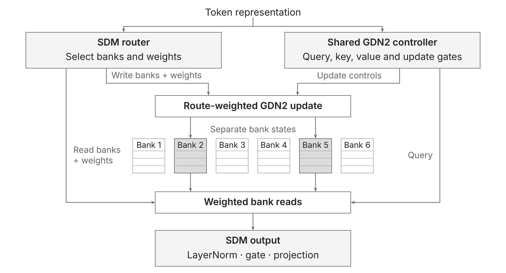
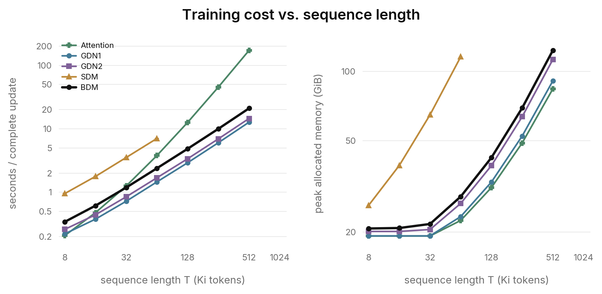
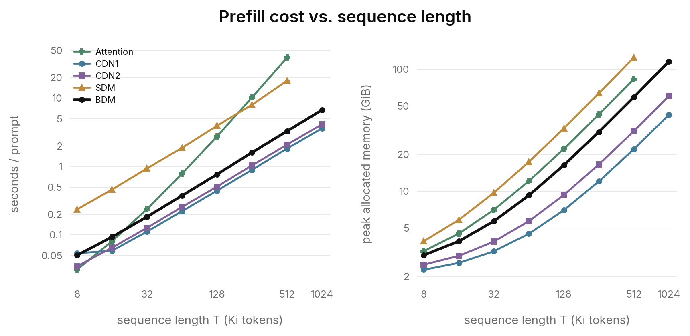
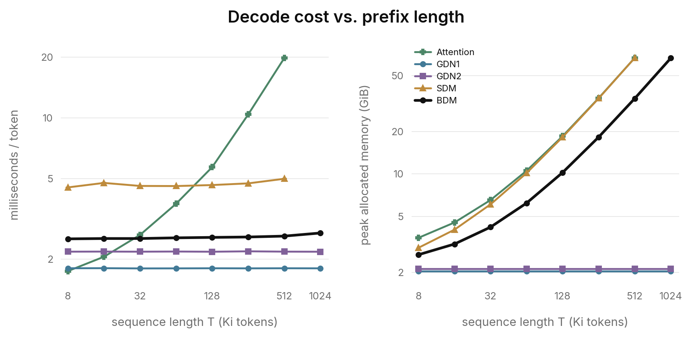
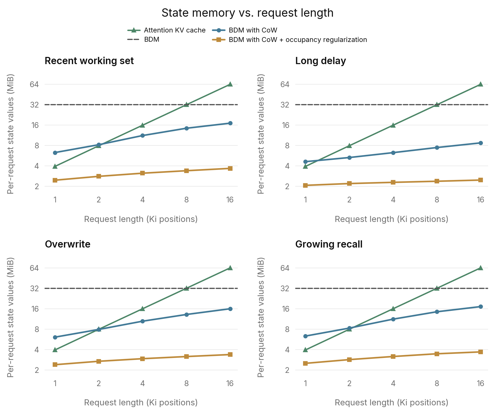

# Block Delta Memory: Sparse Recurrent Memory with Dense Execution

## BDM: sparse routing, dense updates

Block Delta Memory (BDM) is a recurrent alternative to an attention layer:
a [Mixture-of-Memories](https://arxiv.org/abs/2502.13685) model that uses
[Sparse Delta Memory (SDM)](https://arxiv.org/abs/2607.07386) for routing and
[Gated DeltaNet-2 (GDN2)](https://arxiv.org/abs/2605.22791) for its memory
banks. It extends SDM by replacing individually addressed rows with small
matrix states. The router chooses which banks each token reads and writes;
GDN2 determines how each selected bank stores and retrieves information.

Because each bank is a small dense matrix, the reads and writes routed to it
can be gathered in causal order and executed as dense matrix work on the GPU.
At fixed bank size, per-token access still scales as in SDM; what changes is
how efficiently that work executes. The tradeoff is coarser
addressing: rows within a bank are accessed together, and writes to the same
bank can interfere.

## From a context window to a memory budget

An attention transformer keeps a key and a value for every token in its
context. That growing record supports flexible retrieval, but every new query
must search it: storage and decode work grow with the context, and processing
a full prompt costs quadratic attention work. The context window is therefore
an operating budget that governs latency, memory, and how an application
manages its history.

For a long-lived agent, the work can outlast that window, and the surrounding
system must decide what to discard, summarize, or retrieve again. Compaction
rewrites the history into a usable context and risks dropping details a future
query will need. A recurrent model moves that decision into its state update:
each token can add information, revise an association, or weaken an older
memory, and the prediction objective trains what is retained and what is
forgotten. This offers a path toward continuous learned compression instead of
periodically rebuilding a token transcript.

The difficulty is giving that process enough memory. Work on
[copying](https://arxiv.org/abs/2402.01032) and
[associative recall](https://arxiv.org/abs/2402.18668) formalizes the capacity
constraint: the state required for reliable exact recall grows with the
information to be retained. SDM makes a larger state affordable in compute
through sparse access, reading and writing only a few rows per token regardless
of how many rows exist.

The design question then changes from how many tokens fit in a window to how
much memory the model has for retaining their information. The state can keep
receiving updates past any particular sequence length, with learned writes and
forgetting determining what survives, and at fixed capacity per-token work does
not grow with the history already processed. Increasing capacity still costs
storage and routing work, but selected access stays small, making larger memory
an option even for local inference with memory headroom and limited compute.

SDM leaves a practical obstacle: its fine-grained row reads and updates are
difficult to execute efficiently on a GPU. Sparse access reduces the work that
must be done, but small, indirectly addressed operations still carry a
substantial constant-factor slowdown relative to dense recurrent models. That
gap makes it harder to realize the practical benefit of a large, continuously
updated memory.

## Architecture

### Outer routing

BDM routes with [Residualized Routing for Sparse Delta Memory](https://github.com/p0rc314in/residualized-sdm-routing),
using a bank in place of a row as the address. Its $N$ memory rows form
$J=N/S$ banks of $S$ rows. Reading and writing each select $B$ banks, accessing
$K=BS$ rows per role, and a softmax over the selected scores gives the read and
write probabilities $r_{t,j}$ and $p_{t,j}$ for bank $j$ at token $t$, zero for
unselected banks.

Because the router addresses banks, its product key factors the bank count
rather than the row count, as a near-square pair $J=J_1J_2$. With $N=2048$ and
$S=8$, the 256 banks form a $16\times16$ table: each token scores 32 factor
entries instead of 256 banks, and selecting eight banks accesses 64 rows per
role. Initial memory, below, factors the row count instead.

### Shared controller, separate bank states

Every bank in a layer uses the same GDN2 controller weights. A bank has its
own recurrent state but no query, key, value, or gate projections of its own,
so the controller runs once per token and its outputs are reused by every
selected bank.

| Item | Scope |
|---|---|
| Learned query, key, and value projections | Shared across banks in a layer |
| Learned decay, erase, and write-gate projections | Shared across banks in a layer |
| Token's inner query, key, value, and update controls | Shared across banks in a layer |
| Recurrent matrix $M_{t,j}$ | Separate for each bank |
| Router-assigned write strength $p_{t,j}$ | Separate for each bank |
| Router-assigned read weight $r_{t,j}$ | Separate for each bank |

The router's write probability scales the entire bank update. BDM
multiplies GDN2's three state-changing controls by $p=p_{t,j}$ before applying
its recurrence:

| GDN2 control | Routed control |
|---|---|
| Log decay $g_t$ | $p g_t$ |
| Erase gate $\beta_t$ | $p\beta_t$ |
| Value-write gate $\omega_t$ | $p\omega_t$ |

At zero write strength the state is unchanged; at unit strength the update is
GDN2's. Scaling log decay makes retention $\exp(g_t)^p$, so a weak write also
forgets weakly. Writes precede reads at the same token, and a bank selected
only for reading is not modified. Recurrent state is stored in BF16, with FP32
recurrence arithmetic.

### Short convolution

BDM follows SDM's token-local controller design and omits GDN2's short
query/key/value convolutions, computing those projections directly from the
current token's hidden representation. A matched single-seed
[development ablation](APPENDIX.md#bank-interface-ablations) supported this
choice: adding GDN2's size-four convolutions improved WikiText loss but cut
recall sharply, reducing one-hop exact accuracy from 99.9% to 8.1%.

### Learned initial memory and bank mapping

BDM reuses [Product-Key Initialization for Sparse Delta Memory](https://github.com/p0rc314in/productkey-init-sdm),
which composes each row's starting value from two small learned tables. It uses
the same near-square factorization as the router, applied to the row index
rather than the bank index, because the initial state must still distinguish
rows within a bank. With $N=PQ$ (for example, $2048=32\times64$) and learned
tables $U\in\mathbb R^{P\times V}$ and $Z\in\mathbb R^{Q\times V}$, where $V$
is the value width, row $s$ of bank $j$ has zero-based flattened index $jS+s$
and starts at

$$
M_{0,j}[s,:]=U_{\lfloor(jS+s)/Q\rfloor,:}+Z_{(jS+s)\bmod Q,:}.
$$

Each bank therefore starts as an $S\times V$ matrix assembled from consecutive
rows. Learned initial memory costs $(P+Q)V$ parameters instead of $NV$, while
subsequent writes can still develop a full $NV$-value state. The near-square
row factors matter: in a development ablation, composing the table from separate
bank and slot factors instead sharply reduced recall
([initial-memory geometry](APPENDIX.md#initial-memory-geometry)).

### Reading and output

Each selected bank returns a GDN2 read vector, rather than an individual
stored row. The inner query $q_t$ reads the bank's updated matrix, and the
router's read probability weights the result:

$$
z_{t,j}=S^{-1/2}M_{t,j}^{\top}q_t,
\qquad y_t=\sum_j r_{t,j}z_{t,j}.
$$

Each $z_{t,j}$ is a $V$-dimensional vector. Only these retrieved vectors are
summed; the bank states remain separate. The combined vector passes through
SDM's LayerNorm, sigmoid output gate, and biased projection back to model
width, with the gate and projection using GDN2's scaled-Xavier weight
initialization.

## Result

Every comparison uses the same transformer-style residual stack, replacing each
attention layer with the named sequence mixer and keeping the feed-forward
layers. Recurrent mixers are commonly paired with some attention layers in
hybrid stacks to recover retrieval; here, every model other than the attention
baseline is fully recurrent, so the comparison tests BDM as a complete
replacement for attention. Besides attention and SDM, the controls are
[Gated DeltaNet](https://arxiv.org/abs/2412.06464) (GDN1), GDN2, and
Mixture-of-Memories.

### WikiText-103 and Adaptive Recall

The comparison uses eight-layer, width-128 models with about 15–17M parameters
on WikiText, trained on about 354M tokens. Adaptive Recall uses the same
processing network with a structured input/output interface. SDM and BDM use
$N=2048$ and access $K=64$ rows per role; BDM selects eight banks of eight rows.
Values are terminal test means ± sample standard deviation over three seeds.

**Language modeling**

| Model | WikiText-103 test NLL |
|---|---:|
| Attention | 4.3588 ± .0060 |
| GDN1 | 4.3006 ± .0126 |
| GDN2 | 4.2856 ± .0090 |
| Mixture-of-Memories | 4.3353 ± .0043 |
| SDM | 4.3598 ± .0162 |
| BDM | 4.3394 ± .0154 |

**Recall**

| Model | Span exact % | Overwrite exact % | One-hop exact % |
|---|---:|---:|---:|
| Attention | 99.23 ± .45 | 96.53 ± .39 | 99.21 ± .12 |
| GDN1 | 0.00 ± .00 | 0.00 ± .00 | 0.00 ± .00 |
| GDN2 | 12.92 ± 5.47 | 15.86 ± 6.19 | 0.00 ± .00 |
| Mixture-of-Memories | 5.98 ± 6.02 | 6.67 ± 7.63 | 0.00 ± .00 |
| SDM | 64.88 ± 6.46 | 88.03 ± 1.94 | 97.82 ± .63 |
| BDM | 97.24 ± 1.33 | 97.97 ± 2.26 | 98.97 ± .67 |

The dense recurrent models reach the lowest language loss yet score poorly on
recall: low loss alone does not show that a model retains the information these
tasks need. BDM pairs GDN2's dense update with a much larger addressable
state and keeps the strong recall of sparse memory.

### BabyLM

BabyLM extends the language-learning comparison to 16 layers, width 512,
86.34M BDM parameters, and about 1.7B training tokens on the 2026 strict corpus.
SDM and BDM both use $N=2048$, access $K=64$ rows per role, and train at context
length $T=2048$. Each model has one pretraining seed and is fine-tuned on the
official tasks through the same [evaluation adapter](APPENDIX.md#babylm).

| Task / metric % | Attention | SDM | BDM |
|---|---:|---:|---:|
| BoolQ accuracy | 68.62 | 68.38 | 70.46 |
| MNLI accuracy | 53.97 | 52.73 | 53.32 |
| MRPC F1 | 80.66 | 80.13 | 81.21 |
| MultiRC accuracy | 60.77 | 62.05 | 57.84 |
| QQP F1 | 68.13 | 66.36 | 67.91 |
| RTE accuracy | 56.83 | 56.83 | 58.99 |
| WSC accuracy | 59.62 | 65.38 | 61.54 |

BDM's final training loss is about 0.05 nats above attention's and SDM's
([training curves](APPENDIX.md#training-loss)); that gap does not carry over
into a consistent deficit on these downstream tasks.

## Capacity and execution cost

### What scales

For the single-head BDM setting, $B$ selected banks of $S$ rows give $K=BS$
accessed rows, each with $V$ value channels. The attention comparison uses full
causal attention with total key and value widths $D$. Counts cover memory
mixing, including BDM's capacity-dependent router, and omit FFNs and other
token-local projections. BDM's product-key factors are near-square, and $K$ and
$S$ are fixed.

| Quantity per layer | BDM | Attention |
|---|---|---|
| State update and retrieval per new token | $O(KV)$ | $O(TD)$ |
| Separate routing per new token | $O(D\sqrt{N/S})$ | None; attention scores all stored keys |
| Memory processing over a $T$-token prompt, including routing | $O(TKV + TD\sqrt{N/S})$ | $O(T^2D)$ |
| Learned initial-state parameters | $O(\sqrt N V)$ | None; keys and values are computed from tokens |
| Per-request state | $NV$ values | $2TD$ values |

Attention's cache stores two vectors per token, a key and a value, while BDM's
recurrent state stores one value vector per memory row. At matching vector
width ($V=D$) and precision, $N=T$ therefore gives BDM half the state storage
of the attention KV cache.

At fixed bank size, these terms match SDM's: banking changes how the selected
updates and reads execute, not how they scale. The $\sqrt N$ initial-state term
comes from product-key initialization, which replaces SDM's full $NV$ learned
table. Routing is the one per-token cost that still grows with capacity.

### Measured sweep

The measurements increase sequence length $T$ and sparse memory capacity
together, $N=T$, while holding selected access at $K=64$ rows per role
per head, so per-token routing work also grows across the sweep. For decode,
$T$ is the prepared prefix length. Each point measures the full model on one
H200: batch one, 16 layers, width 2048, including FFNs and embeddings.

| Model | State at length $T$ | Access per token, per head | What grows with $T$ |
|---|---|---|---|
| Attention | Keys and values for $T$ positions | All $T$ positions | Stored history and retrieval work |
| GDN1 / GDN2 | Fixed dense state: 64 rows | All 64 rows | Neither state nor access |
| SDM | $N=T$ rows | 64 selected rows | Capacity and routing; access is fixed |
| BDM | $N=T$ rows, grouped into banks | Eight selected banks × eight rows | Capacity and routing; access is fixed |

The recurrent layouts match active scalar state at $64D$ values per layer per
role, where $D$ is model width, though their controllers and head geometries
differ. Both axes of each figure are logarithmic, and curves end at their last
successful measurement.

The measurements follow the scaling table. Attention's training and prefill
cost grows quadratically with context and its decode cost linearly, while the
recurrent models stay close to linear in training and prefill and nearly flat
in decode; by 32K tokens attention is slower than BDM on every axis, and by
512K the gap is roughly an order of magnitude. What separates BDM from SDM is
the constant factor. SDM's fine-grained row operations take about 2× BDM's time
in decode, 3× in training and 5× in prefill, while BDM takes about 1.2–1.6×
GDN2's time: closer to another dense GDN variant than to SDM, with SDM's large
capacity intact. Peak memory, at the worst-case $N=T$ allocation, stays in line
with attention's in all three settings.

### Logical capacity and allocated memory

A recurrent model can have as much state storage as an attention KV cache, but
naively allocating that entire state for every request commits worst-case
storage even to a short prompt. Two existing SDM extensions apply to BDM's
banks and allow a large memory capacity with a smaller private working set:

| Strategy | Mechanism |
|---|---|
| [Copy-on-Write SDM](https://github.com/p0rc314in/copy-on-write-sdm) | Untouched banks use shared learned initialization. A bank becomes private on its first write; later writes reuse that allocation. |
| Occupancy regularization | The row-occupancy regularizer from [Elastic SDM](https://github.com/p0rc314in/elastic-sdm) is applied to banks, penalizing the fraction written to encourage reuse. |

Copy-on-write (CoW) changes allocation; occupancy regularization changes
learned access. The following small-scale illustration fixes memory capacity at
$N=16{,}384$ and varies request length from 1k to 16k positions across
four workloads, using eight-layer, width-128 models with 64 accessed rows per
role and BF16 state. The regularization coefficient was selected using recall
validation.

The measured bank unions show that allocated state can follow the request's
working set rather than its full capacity. Curves count state-value bytes; the
attention KV and fully allocated BDM lines are calculated references. Model
weights, allocation metadata, and temporary buffers belong to the peak-memory
measurements above.

## What BDM buys

BDM can replace attention throughout a model, without retaining attention layers
in a hybrid stack. The fully recurrent BDM models evaluated here combine strong
recall with language learning competitive with attention, making BDM a
practical alternative for the sequence-mixing layers of a language model.

The appeal, shared with SDM, is a shift from a context-window budget to a memory
budget: capacity sets how much the model can retain, learned writes and
forgetting decide what it retains, and sparse access keeps per-token work
independent of the history already processed.

BDM addresses the execution gap that made this design expensive in SDM. Grouping
rows into banks turns fine-grained sparse operations into dense GPU work,
bringing execution closer to dense recurrent models while retaining a large
addressable memory. The tradeoff is coarser addressing within each bank; the
benefit is SDM's memory model at substantially lower execution cost.

Because each token reads and writes only its selected banks, most of BDM's
state sits idle at any given step: capacity mostly costs total memory rather
than memory bandwidth or compute. A sparse mixture-of-experts feed-forward layer
makes the same trade for parameters, so pairing the two gives a model a large,
mostly idle footprint while keeping per-token bandwidth and compute small.
Large local models on unified-memory machines, where memory is plentiful and
bandwidth limits decode, are one example. More broadly, BDM lets memory capacity
grow while per-token cost stays nearly flat.

[Appendix: equations, configurations, and complete evaluation details](APPENDIX.md)
· [Implementation](implementation/) · [Recorded results](data/)
· [Reproduce the experiments](reproduction/README.md)

## References

- Loïc Cabannes et al., [Sparse Delta Memory: Scaling the State of Linear RNNs through Sparsity](https://arxiv.org/abs/2607.07386), 2026.
- Ali Hatamizadeh, Yejin Choi, and Jan Kautz, [Gated DeltaNet-2: Decoupling Erase and Write in Linear Attention](https://arxiv.org/abs/2605.22791), 2026, and its [reference implementation](https://github.com/NVlabs/GatedDeltaNet-2).
- Songlin Yang, Jan Kautz, and Ali Hatamizadeh, [Gated Delta Networks: Improving Mamba2 with Delta Rule](https://arxiv.org/abs/2412.06464), 2024.
- Jusen Du et al., [MoM: Linear Sequence Modeling with Mixture-of-Memories](https://arxiv.org/abs/2502.13685), 2025.
- Guillaume Lample et al., [Large Memory Layers with Product Keys](https://arxiv.org/abs/1907.05242), 2019.
- Samy Jelassi et al., [Repeat After Me: Transformers are Better than State Space Models at Copying](https://arxiv.org/abs/2402.01032), 2024.
- Simran Arora et al., [Simple linear attention language models balance the recall-throughput tradeoff](https://arxiv.org/abs/2402.18668), 2024.
- Stephen Merity et al., [Pointer Sentinel Mixture Models](https://arxiv.org/abs/1609.07843), 2016.
- Leshem Choshen et al., [BabyLM Turns 4 and Goes Multilingual: Call for Papers for the 2026 BabyLM Workshop](https://arxiv.org/abs/2602.20092), 2026.
- p0rc314in, [Residualized Routing for Sparse Delta Memory](https://github.com/p0rc314in/residualized-sdm-routing), 2026.
- p0rc314in, [Product-Key Initialization for Sparse Delta Memory](https://github.com/p0rc314in/productkey-init-sdm), 2026.
- p0rc314in, [Copy-on-Write SDM](https://github.com/p0rc314in/copy-on-write-sdm), 2026.
- p0rc314in, [Elastic SDM](https://github.com/p0rc314in/elastic-sdm), 2026.
